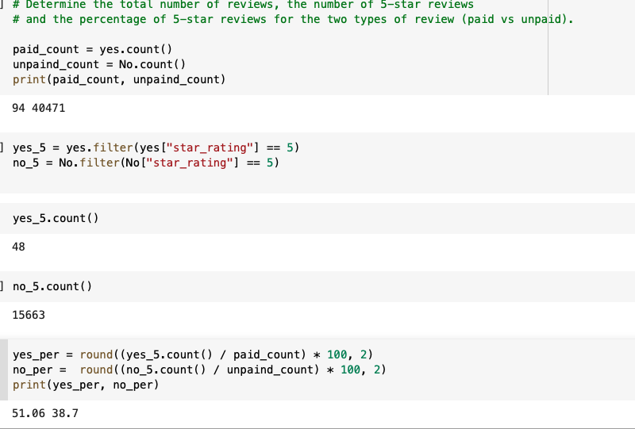

# Amazon_Vine_Analysis
Christopher Padilla Gregoro

# Overview 
  The purpose of the project is to use PySpark to determine if the dataset has any bias towards favorable reviews from vine members. I choose to analyize data from the video game industry. 
  
# Results 
1. The number of paid vine programs in the video game industry is 94. Howeve, the number of unpaid vine programs in the video game industry is 40,471
2. The number of 5 star reviews for paid programs were 48. While for unpaid programs the number of 5 star reviews was 15,663
3. The percentage of 5 star reviews that was paid 51.06%. The unpaid program had a percentage of 38.7%

The following images displays all the calculations from the result.

# Summary 
  The video game industry is constantly trying to create the next greastest game. It is no surprise that paid programs from this industry will become for successful than unpaid based on there 5 star review. Paid programs will have more opportunities to create the next biggest video game than unpaid. In this analysis it is very clear there is bias towards paid progams. Another additional analysis could be preformed to prove this statement, such as reviewing the success pf5 star rating games between paid and unpaid. 
